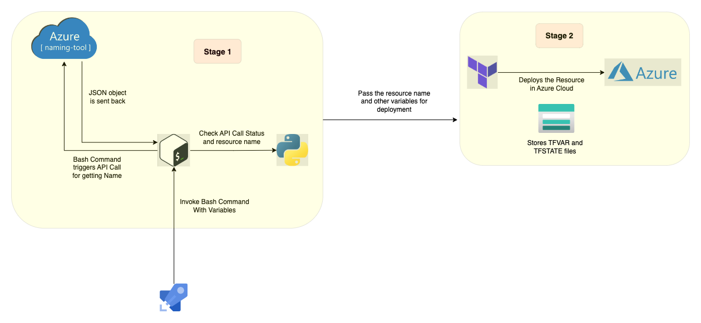
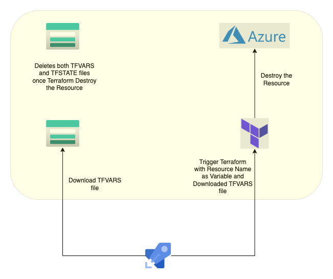

# Introduction

To be filled by **Arlan / Anubhav**

# Overview of the process

The code utilizes multiple technological stack to overcome the combined hurdle of automated Azure resources naming and resource deployment and also include properties of self-service Infrastructure (preview) without using Terraform Plus licence or any third party tool such as Morpheus data. Despite the complex process the code is simplified for ease of understanding and maintenance. The process is mostly Pipeline driven. Let's understand how the code works.

Deploy Process



Destroy Process



# Prerequisites

## Azure Storage Account

Please create an [Azure Storage Account](https://learn.microsoft.com/en-us/azure/storage/common/storage-account-create?tabs=azure-portal#create-a-storage-account-1) and a [container](https://learn.microsoft.com/en-us/azure/storage/blobs/storage-quickstart-blobs-portal#create-a-container) named **tfstate** to store Terraform State Files (You may change the name of the container in **providers.tf**). Please note the Service Principle should have access to the Storage Account. Note the [Access Key](https://learn.microsoft.com/en-us/azure/storage/common/storage-account-keys-manage?tabs=azure-portal#view-account-access-keys) for the Storage Account from Azure Portal.

|Key Name|Value|
|:---|:---|
|ARM-ACCESS-KEY|Azure Storage Account Access Key|
|SA-NAME| Storage Account Name|

Note :: The details of the Storage Account must be filled in **provider.tf** file backend configuration.

## Service Connection
Azure DevOps Pipeline requires Service Connection to run tasks. The Service Principle should have access to Key Vault Secrets ([Get and List Permission](https://learn.microsoft.com/en-us/azure/devops/pipelines/release/azure-key-vault?view=azure-devops&tabs=yaml#set-up-azure-key-vault-access-policies)) to retrieve Key Vault Secret Values required during running the task. Please refer to this [official article](https://learn.microsoft.com/en-us/azure/devops/pipelines/library/service-endpoints?view=azure-devops&tabs=yaml#create-a-service-connection) for creating the Service Connection from a Service Principle. Note the following values for a Service Principle from Azure Portal.

|Key Name|Value|
|:---|:---|
|ARM-CLIENT-ID|Application ID of the Service Principle|
|ARM-CLIENT-SECRET|Client Secret of the Service Principle|
|ARM-TENANT-ID|Azure Tenant ID|

## Configure Azure Naming Tool

It is out of the scope of this process to include full tutorial about Azure Naming Tool. However, please check few tutorial available [here](https://www.youtube.com/watch?v=Ztmxx_KhZdE) and [here](https://www.youtube.com/watch?v=gO5jAeqtWlc). As part of this POC project we have configured the Naming Tool to generate resource name.

## Azure Naming Tool API Keys

The API key is used to authenticate external tools for getting names from the Azure Naming Tool. In order to obtain an API key please follow the process -

- Go to Azure Naming App Web Portal.
- Login by clicking on **Admin** option from left menu.
- Check the Keys under **API Keys** option.

Note the following values

|Key Name|Value|
|:---|:---|
|API-URL|Azure Naming Tool URL|
|API-KEY|Azure Naming Tool API Key|

## Key Vault
An Azure Key Vault is required to store Secrets which are used by the pipeline to authenticate against Azure and Azure DevOps to perform it's desired operation. Please note the Service Principle mentioned [above](#service-connection) must have **GET** and **LIST** for the Key Vault Secrets. Please [create the secrets](https://learn.microsoft.com/en-us/azure/key-vault/secrets/quick-create-portal#add-a-secret-to-key-vault) in Azure Key Vault. You may refer to the [Service Connection](#service-connection) and [Azure DevOps PAT and URL](#azure-devops-pat-and-url) section for values.

Secrets to be created in Azure Key Vault

```
ARM-CLIENT-ID
ARM-CLIENT-SECRET
ARM-TENANT-ID
ARM-ACCESS-KEY
SA-NAME
API-KEY
```

## Variable Groups
The code needs an Azure DevOps Pipeline Variable Group linked to an existing Azure Key Vault containing the Secrets. Please refer to this [official article](https://learn.microsoft.com/en-us/azure/devops/pipelines/library/variable-groups?view=azure-devops&tabs=yaml#link-secrets-from-an-azure-key-vault) for more details.

## Updating Pipeline YAML file with values

Once done with all the [above steps](#prerequisites) update the both the pipeline files inside **.pipelines** folder in the repository. **You should also change values of Azure DevOps Pipeline Parameters as pr your Infrastructure. Please check [here](#general-parameters) for more details.**

```
variables:
  - name: AZURE_SERVICE_CONNECTION
    value: '< SERVICE CONNECTION NAME >'
  - group: '< VARIABLE GROUP NAME LINKED TO KEY VAULT >'
  - name: SUBSCRIPTION_ID
    ${{ if eq(parameters.Subscription, 'SUB-1') }}:
      value: xxxxx-xxxxx-xxxxx-xxxxx-xxxxx
    ${{ if eq(parameters.Subscription, 'SUB-2') }}:
      value: yyyyy-yyyyy-yyyyy-yyyyy-yyyyy
```

## Update Provider file with values

You need to update **provider.tf** file with values for the [Azure Storage Account](#azure-storage-account) which will host the Terraform State file.

```
backend "azurerm" {
  resource_group_name  = "< Storage Account Resource Group Name >"
  storage_account_name = "< Storage Account Name >"
  container_name       = "tfstate"
  key                  = "PLACEHOLDER"
}
```

Note :: You can make changes for all the values excluding the **key** value which is dynamically passed in pipeline task command to achieve dynamic state file name.

# Pipelines

Once the updates to the code is complete and the latest code is pushed to the repository please proceed to create the pipelines in Azure DevOps. Please follow the below instruction to create both ([Deploy](#creating-deploy-pipeline) and [Destroy](#creating-destroy-pipeline)) Pipelines.

## Creating Deploy Pipeline

Please follow this instruction to create the deploy pipeline

- Go to **Pipelines** in Azure DevOps
- Click on **New Pipeline** from right top corner
- Select **Azure Repos Git**
- Select your repository containing this code
- Select **Existing Azure Pipelines YAML file**
- Select the branch and select path as **self-service-deploy-storage-account.yaml**
- Click on **Continue**
- Click on **Save** from **Run** drop down menu on top right corner
- You may rename the pipeline by choosing **Rename/move** from top right corner Kebab menu

### Running the Deploy Pipeline

Please follow the instruction to run deploy pipelines

- Go to **Pipelines** in Azure DevOps.
- Click on **All** option and click on the deploy pipeline created [above](#creating-deploy-pipeline)
- Click on **Run Pipeline** from top right corner
- Fill up / select all the required parameters mentioned [here](#pipeline-parameters)
- Click on **Run** Button
- Follow the Pipeline Status

## Creating Destroy Pipeline

Please follow this instruction to create the destroy pipeline

- Go to **Pipelines** in Azure DevOps
- Click on **New Pipeline** from right top corner
- Select **Azure Repos Git**
- Select your repository containing this code
- Select **Existing Azure Pipelines YAML file**
- Select the branch and select path as **elf-service-destroy-storage-account.yaml**
- Click on **Continue**
- Click on **Variables** button and then **New Variable**
- Provide **Name** as **RESOURCE_NAME** and keep **Value** empty. Select **Let users override this value when running this pipeline**
- Click on **OK** button and then on **Save** button
- Click on **Save** button
- You may rename the pipeline by choosing **Rename/move** from top right corner Kebab menu

### Running the Destroy Pipeline

Please follow the instruction to run destroy pipelines

- Go to **Pipelines** in Azure DevOps.
- Click on **All** option and click on the destroy pipeline created [above](#creating-destroy-pipeline)
- Click on **Run Pipeline** from top right corner
- Select **Apply Option** as **No** and click on **Variables** option.
- Click on the variable name **RESOURCE_NAME** and provide the resource name to be destroyed.
- Click on **Update** button and go back.
- Click on **Run** button
- Follow the Pipeline Status

**Note :** - It is recommended to keep **Apply Option** as **No** for first time. Once satisfied with the Terraform Plan output you neeed to rerun the Pipeline keeping **Apply Option** as **Yes**.

# Pipeline Parameters

### General Parameters

Parameters|Options|Comments
|:---|:---|:---|
|Please choose Apply Option|No / Yes| This switches on / off Terraform Apply command.|
|Select the Subscription to deploy|List of Subscription Name| The subscription where the resource will be deployed.|
|Please choose Resource Group Name|List of resource group to deploy| This selects the Resource Group where the resource will be deployed. **Note** that Azure DevOps Pipeline does not support conditional parameters yet and you should select the Resouce Group based on your subscription selection.|
|Select the Environment| List of Environments| This selects the environment value in the resource name.|
|Select the Organization| List of Organizations | This selects the organization value in the resource name.|
|Select the Function| List of Functions | This selects the function value in the resource name. |
|Select the Project|List of Projects | This selects the project value in the resource name.|

### Storage Account Parameters

Parameters|Options|Comments
|:---|:---|:---|
|Please choose Storage Account Kind|List of Azure Storage Account Kind|Choose the kind of Storage Account you need.|
|Please choose Storage Account Tier| List of Azure Storage Account Tier|Choose the tier of Storage Account you need.|
|Please choose Storage Account Replication Type|List of Azure Storage Account Replication Type|Choose the replication type of Storage Account you need.|
|Please choose Storage Account Hierarchical Namespace|Boolean value for [Hierarchical Namespace](https://learn.microsoft.com/en-us/azure/storage/blobs/data-lake-storage-namespace)|Choose appropriate value.|

**Note** - Azure DevOps does not support conditional parameters so choose the correct values. Ex - 

```
Hierarchical Namespace can only be true when Account Tier is Standard or when Account Tier is Premium and Account Kind is BlockBlobStorage
```

## Verify Deployed Resource

The resources can be verified from Azure Web Portal. Additionally you can verify the **TFVARS** and **TFSTATE** file from the Storage Account used in [backend configuration](#backend-configuration).

Storage Account

Additional Files

# Destroy the Infrastructure

## Verify Destroyed Resource

The Storage Account should be deleted from the Azure Subscription including the **TFSTATE** and **TFVARS** file associated with it.

