# Getting Started
To work on this project, you should have the git client and an editor (VS Code is free and capable)

If this is your first time using git, you will need to tell it your name and email address. This can be done using the following two commands (making the obvious changes)

`git config --global user.name "Your Name"`

`git config --global user.email you@example.com`

# Table of Content

- [Overview](#overview-of-the-process)
- [General Configuration](#general-configuration)
    - [Backend Configuration](#backend-configuration)
    - [Variable Group](#variable-group)
- [Generate Name](#generate-resource-name)
    - [Basic Configuration](#basic-configurations)
    - [API Keys](#api-keys)
    - [Test API](#test-api)
- [Deploy the Resource](#deploy-the-infrastructure)
    - [Run Pipeline](#run-deploy-pipeline)
    - [Verify Resource](#verify-deployed-resource)
- [Destroy the Resource](#destroy-the-infrastructure)
    - [Run Pipeline](#run-destroy-pipeline)
    - [Verify Resource](#verify-destroyed-resource)

# Overview of the process

The code utilizes multiple technological stack to overcome the combined hurdle of automated Azure resources naming and resource deployment and also include properties of self-service Infrastructure (preview) without using Terraform Plus licence or any third party tool such as Morpheus data. Despite the complex process the code is simplified for ease of understanding and maintenance. The process is mostly Pipeline driven. Let's understand how the code works.

Deploy Process


Destroy Process


# General Configuration

## Backend Configuration

The backend configuration is present in **provider.tf** file in the repo.

```
backend "azurerm" {
  resource_group_name  = "usea1-sb-namingtool-rg"
  storage_account_name = "usea1sb1namingtoolsa"
  container_name       = "tfstate"
  key                  = "PLACEHOLDER"
}
```

You can make changes for all the values excluding the **key** value which is dynamically passed in pipeline task command to achieve dynamic state file name.

```
terraform init -reconfigure -backend-config="key=$TFSTATE_FILE.terraform.tfstates"
```

## Variable Group

An Azure DevOps Pipeline Library is required to get values required for this process to run. Following KEY and their values should be added in Variable Group.

|Key Name|Description|
|:---|:---|
|API_KEY|Admin API Key from Azure Naming Tool|
|API_URL|Azure Naming Tool URL|
|ARM_ACCESS_KEY|Azure [Storage Account](#backend-configuration) Access Key|
|SA_NAME|Azure [Storage Account](#backend-configuration) Name|
|ARM_CLIENT_ID|Client ID of the App Registration|
|ARM_CLIENT_SECRET|Client Secret of the App Registration|
|ARM_TENANT_ID|Azure Tenant ID|

# Generate Resource Name

It is out of the scope of this process to include full tutorial about Azure Naming Tool. However, please check few tutorial available [here](https://www.youtube.com/watch?v=Ztmxx_KhZdE) and [here](https://www.youtube.com/watch?v=gO5jAeqtWlc). As part of this POC project we have configured the Naming Tool to generate resource name.

## Basic Configurations

The Naming Tool uses Configuration defined by you to generate resource name. There are 2 parts of the Configuration - Base Configuration and Component Configuration.

Base Configuration uses the Component Configuration to generate names whereas the Component Configuration contains the actual configuration.

### Base Configuration

As you can see it simply contains serial wise Components. You can move the components up or down depending on your naming standard. Ex - If you keep Location on top and the Location Component Configuration value for East US is **usea1** the resource name will start with **usea1-XXXX-XXXX**. Similarly, if location configuration is second in the list the resource name will be something like **XXXX-usea1-XXXX**

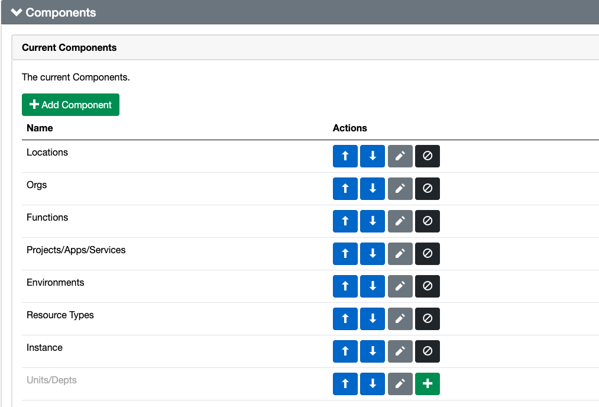

The delimiter is used to separate each components. Here in the configuration the delimiter is **-**. You can use any different delimiter to name your resources. Ex - For this delimiter configuration the resource name will be **XXXX-XXXX-XXXX-XXXX-XXXX**. You can only choose one delimiter in Naming Tool

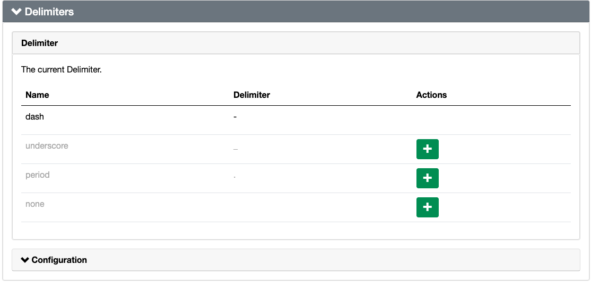

### Component Configuration

The Component Configuration contains the actual configuration of the components. Here are few Examples of the configuration for this POC project

Environment Configuration

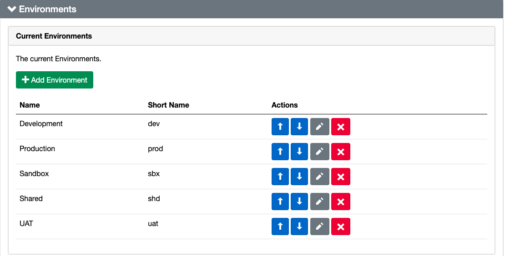

Function Configuration

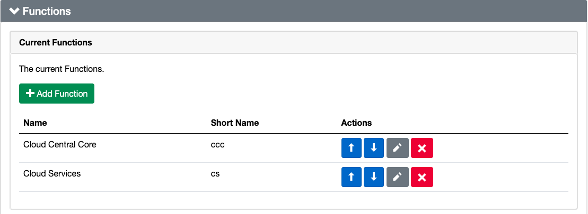

Location Configuration

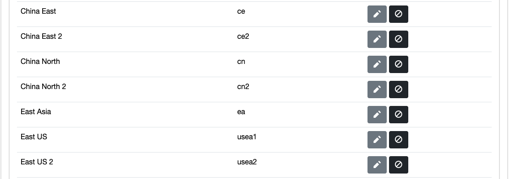

Organization Configuration

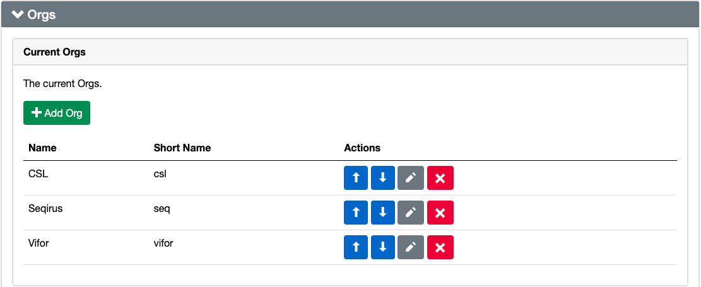

Project/App/Service Configuration

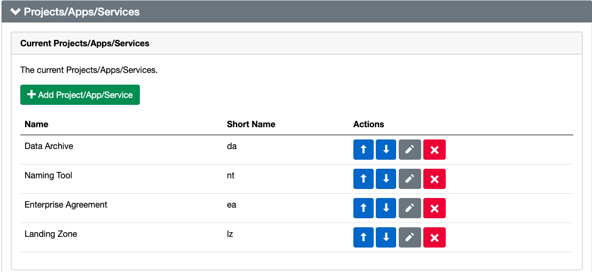

Resource Type Configuration

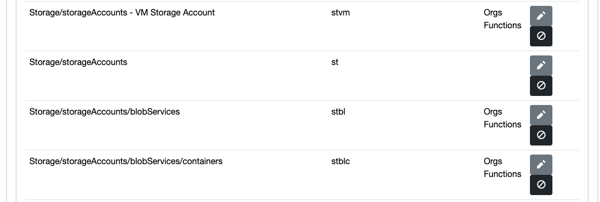

## API Keys

The API key is used to authenticate external tools for getting names from the Azure Naming Tool. For security reason, the screenshot of API key is not added in this Readme file. However, in order to obtain an API key please follow the process -

- Go to Azure Naming App Web Portal.
- Login by clicking on **Admin** option from left menu.
- Check the Keys under **API Keys** option.

## Test API

To test the API name generation please follow the steps below -

- On Azure Naming Tool Home Page click on the swagger API link.

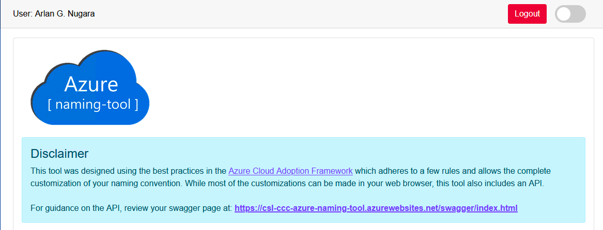

- Scroll down to **ResourceNamingRequests** and click on **/api/ResourceNamingRequests/RequestName** option

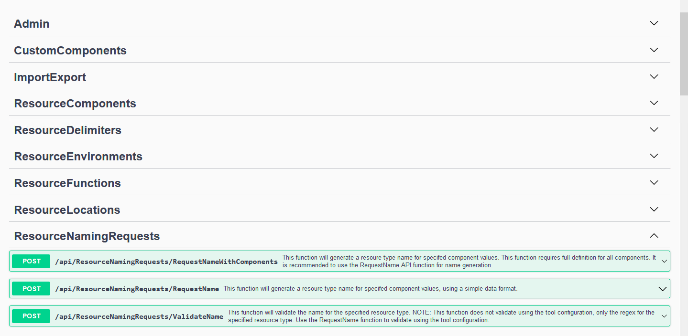

- Click on **Try it out** button

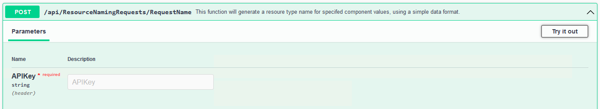

- Provide the details of Components and API Key and click on **Execute** button.

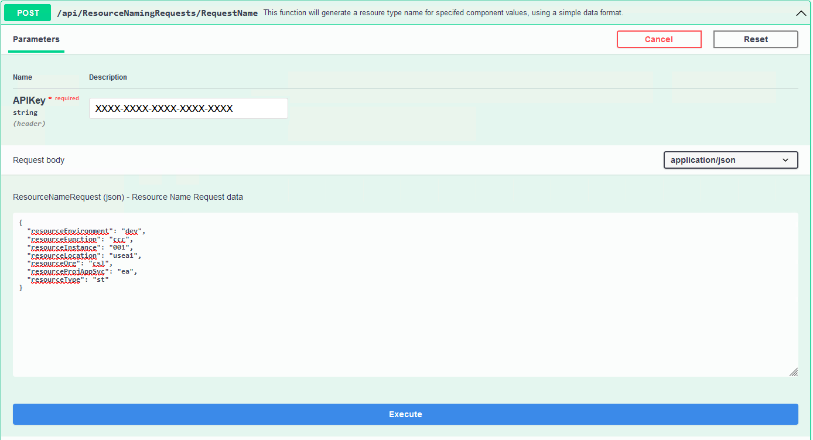

- Check the name and result.

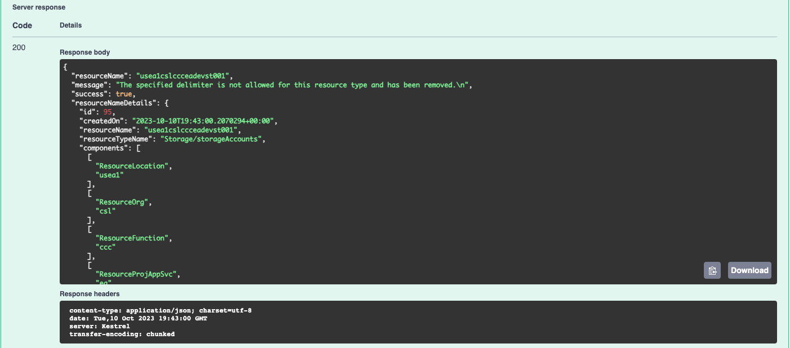

# Deploy the Infrastructure

## Run Deploy Pipeline

To run deploy pipeline please follow the steps below -

- Go to Azure DevOps Pipeline and click on **self-service-deploy-storage-account** pipeline.
- Click on **Run Pipeline** from top right corner.
- Provide the following values and click on **Run** button.

### General Parameters

Parameters|Options|Comments
|:---|:---|:---|
|Please choose Apply Option|No / Yes| This switches on / off Terraform Apply command.|
|Select the Subscription to deploy|List of Subscription Name| The subscription where the resource will be deployed.|
|Please choose Resource Group Name|List of resource group to deploy| This selects the Resource Group where the resource will be deployed. **Note** that Azure DevOps Pipeline does not support conditional parameters yet and you should select the Resouce Group based on your subscription selection.|
|Select the Environment| List of Environment from [Naming tool Environment Component Configuration](#component-configuration)| This selects the environment value in the resource name.|
|Select the Organization|List of Organization from [Naming tool Environment Component Configuration](#component-configuration)| This selects the organization value in the resource name.|
|Select the Function|List of Function from [Naming tool Environment Component Configuration](#component-configuration)|This selects the function value in the resource name.|
|Select the Project|List of Project from [Naming tool Environment Component Configuration](#component-configuration)| This selects the project value in the resource name.|

### Storage Account Parameters

Parameters|Options|Comments
|:---|:---|:---|
|Please choose Storage Account Kind|List of Azure Storage Account Kind|Choose the kind of Storage Account you need.|
|Please choose Storage Account Tier| List of Azure Storage Account Tier|Choose the tier of Storage Account you need.|
|Please choose Storage Account Replication Type|List of Azure Storage Account Replication Type|Choose the replication type of Storage Account you need.|
|Please choose Storage Account Hierarchical Namespace|Boolean value for [Hierarchical Namespace](https://learn.microsoft.com/en-us/azure/storage/blobs/data-lake-storage-namespace)|Choose appropriate value.|

**Note** - Azure DevOps does not support conditional parameters so choose the correct values. Ex - 

```
Hierarchical Namespace can only be true when Account Tier is Standard or when Account Tier is Premium and Account Kind is BlockBlobStorage
```

## Verify Deployed Resource

The resources can be verified from Azure Web Portal. Additionally you can verify the **TFVARS** and **TFSTATE** file from the Storage Account used in [backend configuration](#backend-configuration).

Storage Account

Additional Files

# Destroy the Infrastructure

## Run Destroy Pipeline

To run destroy pipeline please follow the steps below -

- Go to Azure DevOps Pipeline and click on **self-service-destroy-storage-account** pipeline.
- Click on **Run Pipeline** from top right corner.
- Choose the **Subscription** of the Resource to be destroyed.
- Click on **Variables** and then on **RESOURCE_NAME**
- Provide the resource name which was created in [deploy process](#deploy-the-infrastructure).
- Click on **Run** button

## Verify Destroyed Resource

The Storage Account should be deleted from the Azure Subscription including the **TFSTATE** and **TFVARS** file associated with it.

